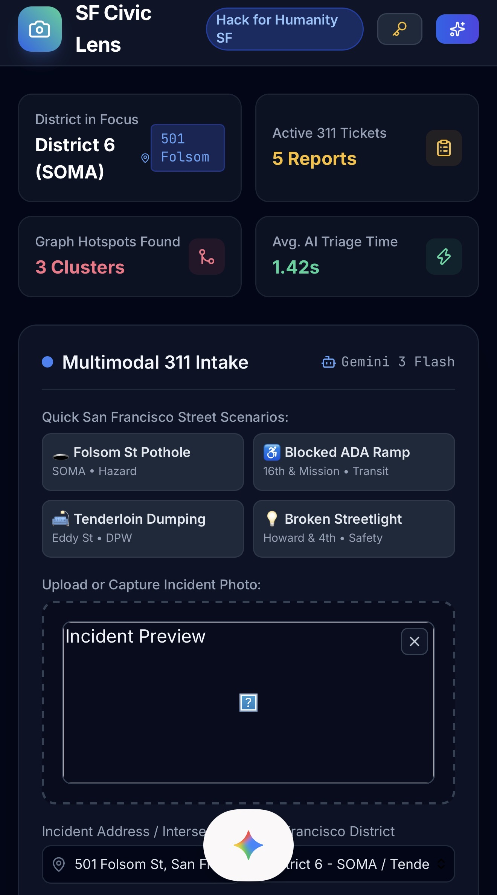
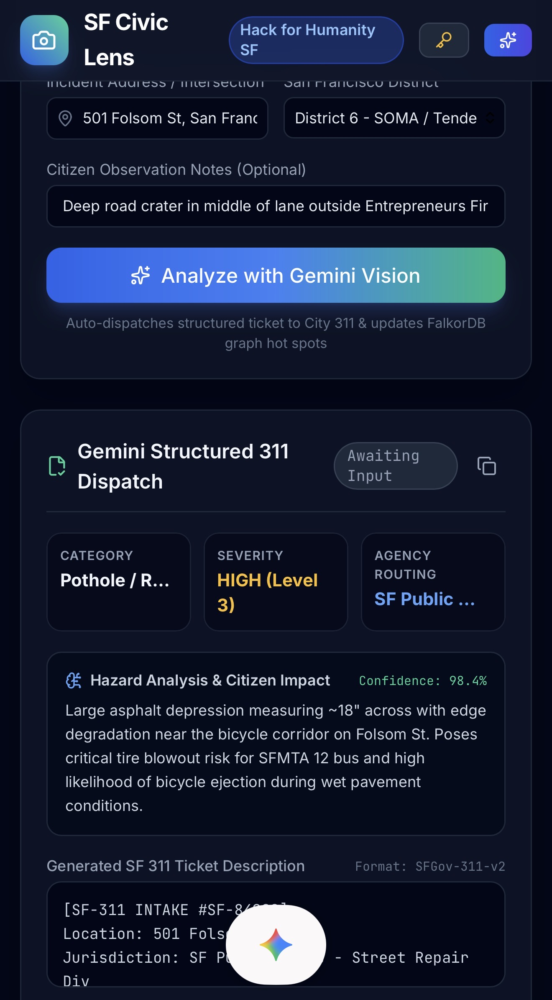
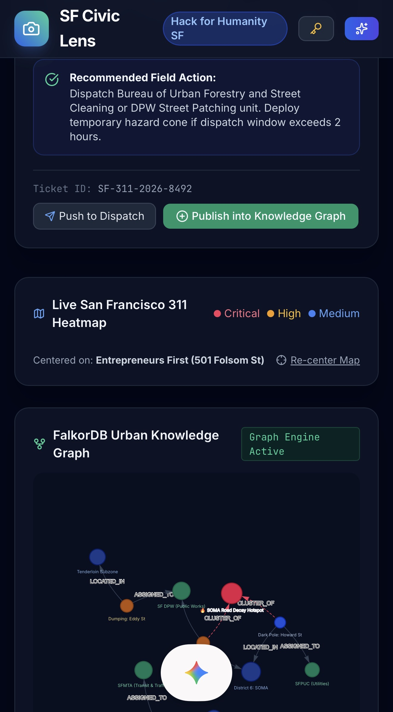

# SF Civic Lens + FalkorDB
[SF Civic Lens Website](https://mlh-pied.vercel.app/)

## What it is about
1. The Local Problem
Official SF 311 form completion takes **4-7 minutes** per issue, causing severe underreporting of ADA ramp blocks, hazardous potholes, and trash in SOMA & Mission.

2. Gemini Multimodal
Extracts incident type, severity index, responsible agency (DPW, SFMTA, SFFD), and drafts official 311 payload in under **2 seconds** from street photos.

3. FalkorDB Knowledge Graph
Correlates tickets into graph entities: (Incident)-[:HOTSPOT_IN]->(District). Uncovers chronic infrastructure neglect clusters using Cypher graph queries.

4. Community Impact
Democratizes municipal reporting for pedestrians, wheelchair users, and transit commuters with _1-click citizen empowerment and auto-routing dispatch_.


|  |  |  |

This project includes a static frontend at `sf_civic_lens_web_application.html` and a small Flask backend at `backend_server.py`.

## Start the backend

From the project folder:

```powershell
set FALKORDB_HOST=r-akgitwzd6h.instance-gqt0k13ju.hc-20vidasdi.us-central1.gcp.f2e0a955bb84.cloud
set FALKORDB_PORT=64100
set FALKORDB_USERNAME=falkordb
set FALKORDB_PASSWORD=_UG418Q-Db7H0Kwwv4Xs54f1
set FALKORDB_SSL=true
python backend_server.py
```

Then open the HTML file in a browser.

## What it records

When a user publishes an incident or dispatches a crew, the backend writes a graph relationship like:

- `(:Person)-[:PERFORMED]->(:Incident)`
- `(:Incident)-[:IN_DISTRICT]->(:District)`

This lets you later query who did what in the graph.

## Example queries

```cypher
MATCH (p:Person)-[r:PERFORMED]->(i:Incident)
RETURN p.name, r.action, i.ticketId, r.timestamp
ORDER BY r.timestamp DESC;

MATCH (p:Person)-[:PERFORMED]->(i:Incident)
WHERE p.name = 'Analyst'
RETURN p.name, i.ticketId, i.category, i.location;
```
